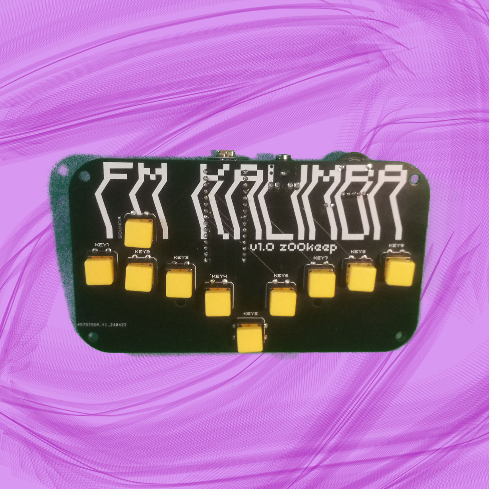

# Synthétiseur FM Kalimba

  
  

Bienvenue dans le dépôt GitHub de votre Synthétiseur FM en forme de kalimba ! Ce guide vous aidera à comprendre comment télécharger le code sur votre carte Arduino Nano et utiliser votre synthétiseur.

## Table des matières
1. [Description du projet](#description-du-projet)
2. [Fonctionnalités](#fonctionnalités)
3. [Utilisation](#utilisation)
4. [mise a jours](#mise-a-jours)
5. [Prérequis](#prérequis)
6. [Téléchargement du code sur l'Arduino Nano](#téléchargement-du-code-sur-larduino-nano)
7. [Dépannage](#dépannage)
8. [Licence](#licence)

## Description du projet

Ce projet est un synthétiseur FM unique en son genre, conçu en forme de kalimba. Il combine la richesse sonore de la synthèse FM avec l’esthétique et la jouabilité d’un kalimba traditionnel.

ce projet est un fork du projet <a href="https://www.instructables.com/Arduino-Synthesizer-With-FM/" >Arduino-Synthesizer-With-FM</a> by <a href="https://www.instructables.com/member/rgco/">rgco</a>

## Fonctionnalités

- **12 Synthèse FM** : Génère des sons riches et complexes grâce à la modulation de fréquence.
- **4 Note Polyphonic** : Possibilé de jouer des accords.
- **Interface en forme de kalimba** : Une interface utilisateur inspirée du kalimba, intuitive et agréable à utiliser.
- **Compatibilité Arduino** : Facile à programmer et mettre à jour avec une carte Arduino Nano.

## Utilisation

1. alimenter votre synthétiseur, via le port USB.
2. brancher la sortie mini jack.
3. choiser votre son via le bouton "sound".
4. regler le volume via la molette.
5. il ne vous reste plus cas jouer.

# mise a jours

## Prérequis

Avant de commencer, assurez-vous d'avoir les éléments suivants :
- Un ordinateur avec un port USB
- Un câble USB
- Une carte Arduino Nano
- Le logiciel Arduino IDE installé sur votre ordinateur
  
## Téléchargement du code sur l'Arduino Nano

Pour télécharger le code sur votre carte Arduino Nano, suivez les étapes suivantes :

1. Assurez-vous que votre Arduino Nano est connecté à votre ordinateur via USB.
2. Ouvrez l'Arduino IDE.
3. Dans l'Arduino IDE, allez dans `Fichier -> Ouvrir...` et sélectionnez le fichier `.ino` du projet situé dans le répertoire cloné.
4. Sélectionnez votre carte Arduino Nano et le port approprié sous `Outils -> Type de carte` et `Outils -> Port`.
5. Cliquez sur le bouton `Téléverser` (icône en forme de flèche vers la droite) pour compiler et téléverser le code sur l'Arduino Nano.

## Dépannage

Si vous rencontrez des problèmes lors de l'utilisation ou du téléchargement du code sur votre synthétiseur, consultez la section [Issues](https://github.com/votre-utilisateur/synthetiseur-fm-kalimba/issues) de ce dépôt pour voir si votre problème a déjà été signalé. Sinon, n'hésitez pas à ouvrir une nouvelle issue.

## Licence

Ce projet est sous licence [MIT](LICENSE).
